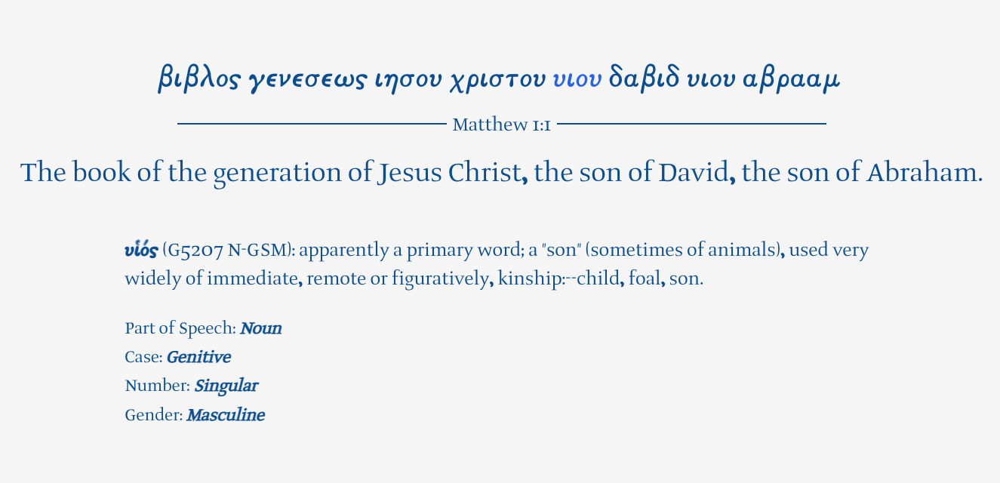

# AnkiGreekNT
### Lua script to generate anki deck of every verse in Greek New Testament 
* **+KJV translation**
* **+Book Chapter:Verse on card with Book tagged**
* **+Strong's Concordance numbers and Robinson's morphology codes included**
* **+Full glossary and morphology for each word on hover/click supported on desktop and mobile**\
\

There are several very good existing biblical greek decks, mostly separated vocabulary, sorted by frequency. I find that the frequency list approach for languages is statistically good for when the texts you are engaging with are totally random, however if your goal with koine is to simply read the Greek New Testament front to back, then learning words separately by frequency seems moot. Add to this the fact that words are much more easily remembered and better understood when learned in the context of a sentence (the reason I exclusively use sentence cards for modern languages), then you might as well just go verse by verse.

One of the things I like about Anki is that despite how complex the setup of things might be, once the initial work is done there is very little "setup-overhead" in the daily learning/reviewing process, so instead of having to open up a GNT to where you left off, AND the KJV to the same place, AND Strong's concordance, AND Robinson's morphology etc, all you have to do is open Anki and everything's there, right where you left off, even if you're on your phone and there's no internet connection. I'd recommend starting with a verse a day and building up from there. If you can manage 5 a day on average you can read the whole thing in about 4 years!

All that being said, it isn't *quiiiite* a one-stop shop, you still need to have knowledge of grammar to fully utilise the deck and understand the original text. Something like Merkle and Plummer is a good starting point.

---
#### Sources
* https://github.com/geoffleyland/lua-csv
* https://github.com/mormon-documentation-project/strongs/blob/master/strongs.csv
* https://github.com/markomanninen/textusreceptus/blob/master/data_original/textus_receptus/greek_textus_receptus_utf8.csv
* https://github.com/byztxt/robinson-documentation/blob/master/doc/DECLINE.COD
* kjv.csv from https://www.biblesupersearch.com/bible-downloads/

---
#### Notes
- Header lines removed
- 3 John 1:14-15 and Rev 12:17-18 merged in TR
- Variants stripped in output deck
- Variant tag stripped from Luke 17:36 manually